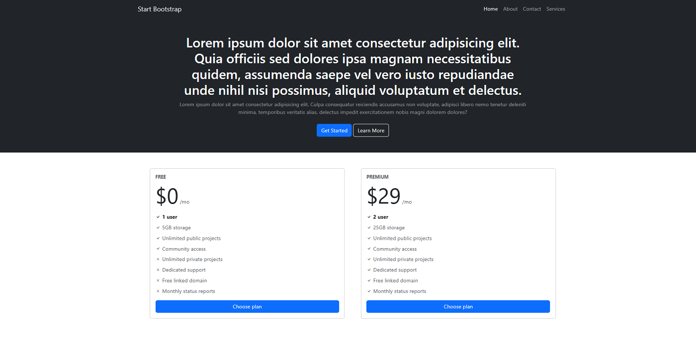

<h1 align="center">Primeiro Site Bootstrap </h1>
 

 Primeira experiência usando Bootstrap. Desenvolvi esse site acompanhando as aulas da faculdade de SI. Segui alguns padrôes ensinados e fiz algumas alterações conforme achei mais interessante. 

 

  

